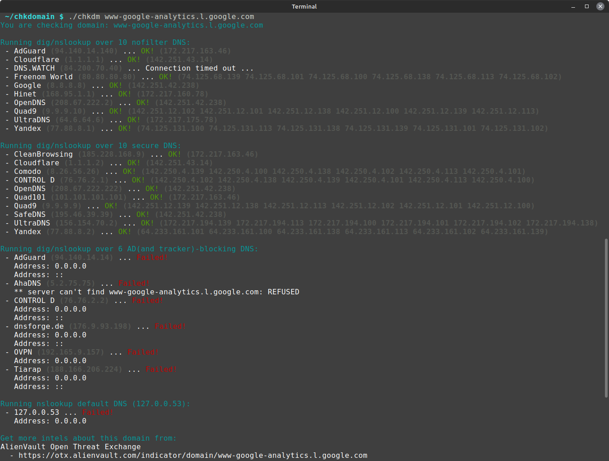

# chkdomain

[](https://app.travis-ci.com/PeterDaveHello/chkdomain)

`chkdomain` checks if a domain can be resolved by no-filter DNS, or has been blocked by secure/protective DNS, and advertisement/tracker-blocking DNS services. It sends queries to well-known DNS servers and checks the resolution success as a basis for determining if the domain is blocked. The tool also provides links to [OSINT](https://en.wikipedia.org/wiki/Open-source_intelligence), domain threat intelligence, and security services for the domain in question.


The DNS services currently used for sending queries are listed below:

| **No-filter** DNS                              | **Secure** DNS                                   | **Ad/Tracker-blocking** DNS                 |
| ---------------------------------------------- | ------------------------------------------------ | ------------------------------------------- |
| [AdGuard][AdGuard] (`94.140.14.140`)           | [CleanBrowsing][CleanBrowsing] (`185.228.168.9`) | [AdGuard][AdGuard] (`94.140.14.14`)         |
| [Cloudflare][Cloudflare] (`1.1.1.1`)           | [Cloudflare][Cloudflare] (`1.1.1.2`)             | [CONTROL D][CONTROL D] (`76.76.2.2`)        |
| [dns0.eu][dns0.eu] (`193.110.81.254`)          | [Comodo][Comodo] (`8.26.56.26`)                  | [dnsforge.de][dnsforge.de] (`176.9.93.198`) |
| [Freenom World][Freenom World] (`80.80.81.81`) | [CONTROL D][CONTROL D] (`76.76.2.1`)             | [OVPN][OVPN] (`192.165.9.157`)              |
| [Gcore][Gcore] (`95.85.95.85`)                 | [dns0.eu][dns0.eu] (`193.110.81.0`)              | [Tiarap][Tiarap] (`188.166.206.224`)        |
| [Google][Google] (`8.8.8.8`)                   | [UltraDNS][UltraDNS] (`156.154.70.2`)            |                                             |
| [Hinet][Hinet] (`168.95.1.1`)                  | [OpenDNS][OpenDNS] (`208.67.222.222`)            |                                             |
| [UltraDNS][UltraDNS] (`64.6.64.6`)             | [Quad101][Quad101] (`101.101.101.101`)           |                                             |
| [OpenDNS][OpenDNS] (`208.67.222.2`)            | [Quad9][Quad9] (`9.9.9.9`)                       |                                             |
| [Quad9][Quad9] (`9.9.9.10`)                    | [SafeDNS][SafeDNS] (`195.46.39.39`)              |                                             |
| [Yandex][Yandex] (`77.88.8.1`)                 | [Yandex][Yandex] (`77.88.8.2`)                   |                                             |

After checking the domain, `chkdomain` provides direct links to the following intelligence services for more information:

- [AlienVault Open Threat Exchange](https://otx.alienvault.com/)
- [Bitdefender TrafficLight](https://trafficlight.bitdefender.com/info/)
- [Google Safe Browsing](https://transparencyreport.google.com/safe-browsing/search)
- [Kaspersky Threat Intelligence Portal](https://opentip.kaspersky.com/?tab=lookup)
- [McAfee SiteAdvisor](https://siteadvisor.com/)
- [Norton Safe Web](https://safeweb.norton.com/)
- [OpenDNS](https://domain.opendns.com/)
- [URLVoid](https://www.urlvoid.com/scan/)
- [urlscan.io](https://urlscan.io/)
- [VirusTotal](https://www.virustotal.com/gui/home/url)
- [Whois.com](https://www.whois.com/whois/)
- [Yandex Site safety report](https://yandex.com/safety/)

If you'd like to build up your own secure DNS, check out the [threat-hostlist](https://github.com/PeterDaveHello/threat-hostlist) repository. It contains many different threat-blocking blocklists to help you create a secure DNS service for your home, office, or elsewhere.

## Usage

Download the [`chkdm`](https://github.com/PeterDaveHello/chkdomain/raw/master/chkdm) script and make it executable:

```sh
$ wget https://github.com/PeterDaveHello/chkdomain/raw/master/chkdm
$ chmod +x chkdm
```

Check domain by running `chkdm`:

```sh
$ ./chkdm <domain name>
```

Additionally, you can put the script in your `$PATH`, such as `/usr/local/bin`, to make it executable from anywhere.

### Using Custom DNS

For custom DNS checks, create `CustomDNS.txt` in the script's directory, listing your DNS server IPs. Use # for comments:

```txt
127.0.0.1
192.168.1.1       # Local DNS
168.95.192.1      # Hinet DNS
```

If you wish to use a custom file location, you can specify a custom file using `CustomDNSFile` variable before executing:

```sh
CustomDNSFile="/path/to/your/dnsfile.txt" ./chkdm ipinfo.tw
```

The script will then include these servers in its checks and provide results.

## Screenshot



## Demo

[](https://asciinema.org/a/474151)

## Dependency

Only a few command-line tools are needed:

- awk
- bash
- dig
- dirname
- head
- nslookup
- readlink
- sed
- sort

Most of the commands (`awk`, `bash`, `dirname`, `head`, `readlink`, `sed`, and `sort`) come pre-installed on common Linux distributions. To install `dig` and `nslookup`, use your package manager (e.g., `apt`, `yum`, `pacman`) to install the `dnsutils` (Debian/Ubuntu) or `bind-utils` (RHEL/CentOS, Arch/Manjaro) package.

## Notice

Please be aware that domain names with records such as `0.0.0.0` or `127.0.0.1` (e.g., `0.ipinfo.tw` or `1.ipinfo.tw`) may yield incorrect results when checked with secure DNS and ad-blocking DNS services. The current detection method for blocked domains is relatively simple. We plan to improve this feature in future updates.

## Additional Resources

There are also some malicious domains blocking services that don't directly provide DNS services and can't be queried via the HTTP GET method. As a result, we are unable to integrate them or list their corresponding query URLs in the check results. However, since they are provided by leading security companies and offer a web interface that allows you to manually submit a domain to retrieve the related intelligence, they are worth mentioning. The services are listed below:

- FortiGuard Web Filter Lookup
  - <https://www.fortiguard.com/webfilter>
- Trend Micro Site Safety Center
  - <https://global.sitesafety.trendmicro.com>
- Palo Alto Networks URL filtering
  - <https://urlfiltering.paloaltonetworks.com/>

## License

GPL-3.0 (GNU GENERAL PUBLIC LICENSE Version 3)

[AdGuard]: https://adguard-dns.com/
[CleanBrowsing]: https://cleanbrowsing.org/
[Cloudflare]: https://1.1.1.1/family/
[Comodo]: https://www.comodo.com/secure-dns/
[CONTROL D]: https://controld.com/
[dns0.eu]: https://www.dns0.eu/
[dnsforge.de]: https://dnsforge.de/
[Freenom World]: https://www.freenom.world/
[Gcore]: https://gcore.com/public-dns
[Google]: https://developers.google.com/speed/public-dns/
[Hinet]: https://dns.hinet.net/
[UltraDNS]: https://www.publicdns.neustar/
[OpenDNS]: https://www.opendns.com/
[Quad101]: https://101.101.101.101/
[Quad9]: https://quad9.net/
[SafeDNS]: https://www.safedns.com/
[OVPN]: https://www.ovpn.com/en/faq/functionality/adblock-dns
[Tiarap]: https://tiarap.org/
[Yandex]: https://dns.yandex.com/
